## {background-color="#2E4057"}

::: {.r-fit-text style="text-align: center; color: white;"}
*How many consider yourself software developers?*

::: fragment
**Me either.**
:::
:::

---

## And yet...

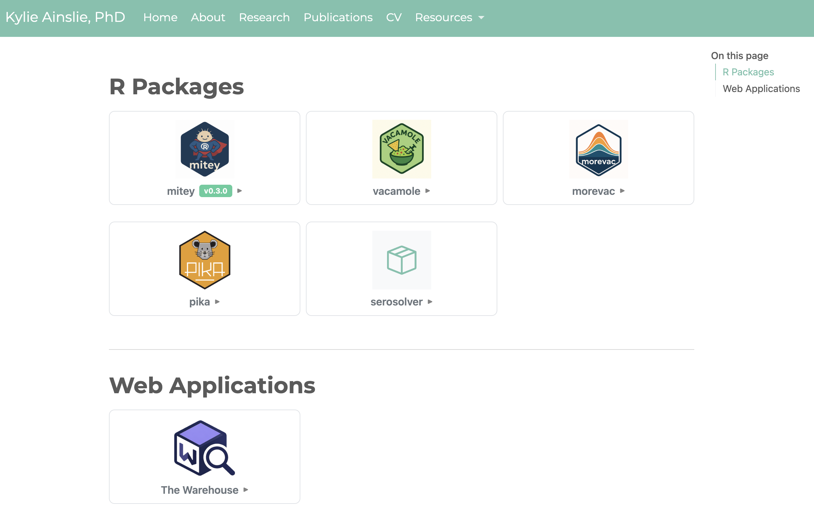{width="100%"}

::: notes
Let it sit. I've developed numerous software packages. 

Pause.

"It started with a folder."
:::

---

## Look familiar?

::: fragment
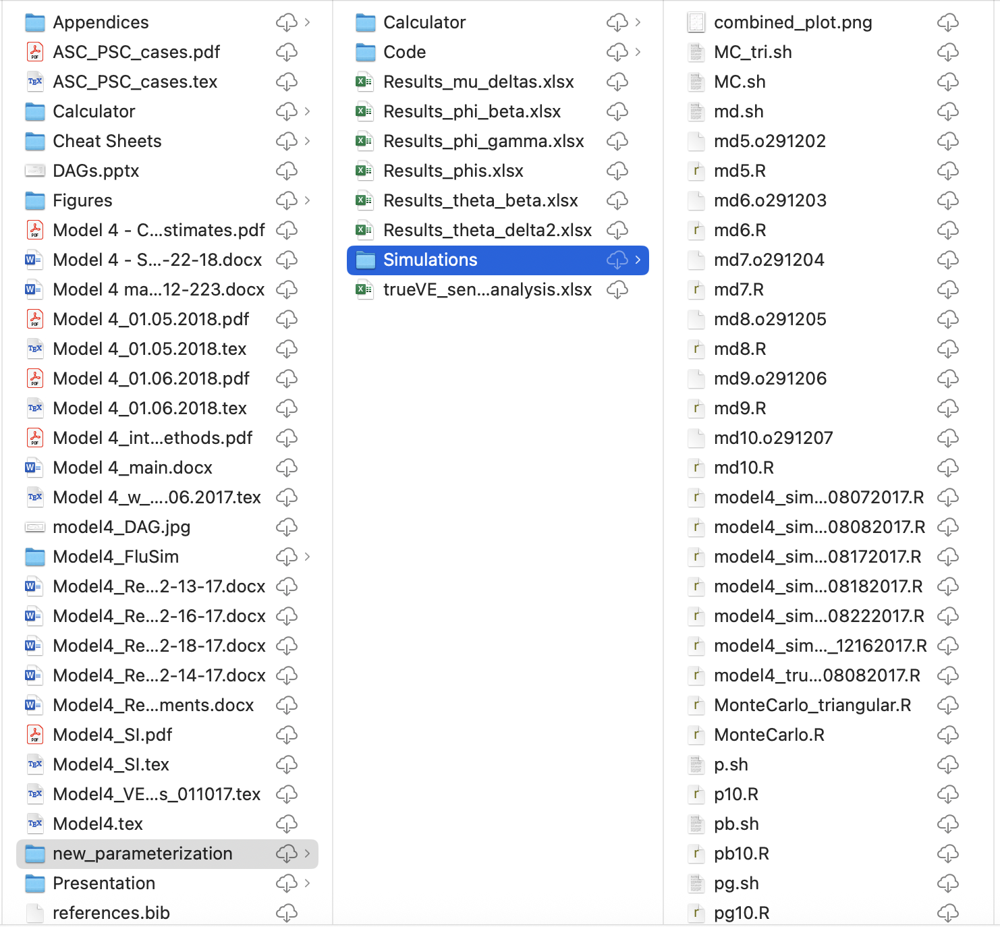{width="60%"}
:::

::: notes
PhD dissertation folder = messy!

"Where is that script? Which version is current? What was I thinking six months ago?"
:::

---

## What if there was a better way?

::: {style="display: flex; align-items: center; justify-content: center; height: 75vh; gap: 2em;"}

::: {.fragment fragment-index=1}
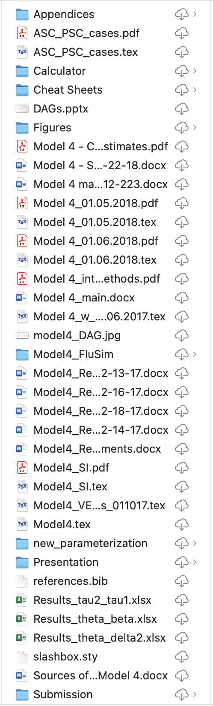{style="max-height: 70vh; object-fit: contain;"}
:::

::: {.fragment fragment-index=2 style="font-size: 2em; flex-shrink: 0;"}
<i class="fas fa-arrow-right"></i>
:::

::: {.fragment fragment-index=3}
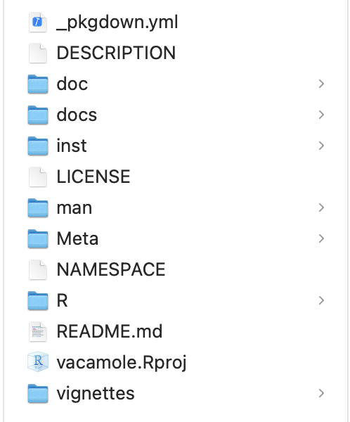{style="max-height: 70vh; object-fit: contain;"}
:::

:::

::: {.fragment fragment-index="4" style="position: absolute; top: 50%; left: 50%; transform: translate(-50%, -50%); background-color: #2E4057; color: white; padding: 24px 60px; border-radius: 8px; font-size: 2.5em; font-weight: bold; text-align: center; z-index: 100;"}
How?
:::

---

## {background-color="#2E4057"}

::: {.r-fit-text style="text-align: center; color: white;"}
**Structure your project like a software package**

::: incremental
1. Organise
2. Share
3. Extend
:::
:::

::: notes
"I started doing this purely for organisation, and came to find that it had many unexpected benefits for my research."
:::

---

## {background-color="#2E4057"}

:::{style="display: flex; justify-content: center; align-items: center; height: 100%;"}
::: {style="text-align: center; color: white; font-size: 4em;"}
Organise
:::
:::

## Organise

<!-- slide 1 -->

::::::: columns
:::: {.column width="50%"}
::: {.fragment fragment-index="1"}
**:x: Typical Project**

```{=html}
<pre style="font-family: monospace; margin: 0; font-size: 24px;">
myproject/
├── analysis.R
├── analysis_FINAL.R
├── analysis_FINAL_v2.R
├── code_guide.pdf
├── data_raw.csv
├── final_report.pdf
├── final_report_FINAL.pdf
├── functions.R
├── methodology.docx
└── more_functions.R
</pre>
```
:::
::::

:::: {.column width="50%"}
::: {.fragment fragment-index="2"}
**:white_check_mark: Package Structure**

```{=html}
<pre style="font-family: monospace; margin: 0; font-size: 24px;">
📦 mypackage/
├── R/            # Code
├── inst/extdata/ # Data + Scripts 
├── man/          # Help files
└── vignettes/    # Analysis
</pre>
```
:::
::::
:::::::

## Organise

<!-- slide 2 -->

::::: columns
::: {.column width="50%"}
**:x: Typical Project**

```{=html}
<pre style="font-family: monospace; margin: 0; font-size: 24px;">
myproject/
├── analysis.R
├── analysis_FINAL.R
├── analysis_FINAL_v2.R
├── code_guide.pdf
├── data_raw.csv
├── final_report.pdf
├── final_report_FINAL.pdf
<span style="background-color: #fff3cd;">├── functions.R</span>
├── methodology.docx
<span style="background-color: #fff3cd;">└── more_functions.R</span>
</pre>
```
:::

::: {.column width="50%"}
**:white_check_mark: Package Structure**

```{=html}
<pre style="font-family: monospace; margin: 0; font-size: 24px;">
📦 mypackage/
<span style="background-color: #fff3cd;">├── R/</span>            # Code
<span style="background-color: #fff3cd;">    ├── functions.R</span>
<span style="background-color: #fff3cd;">    └── more_functions.R</span>
├── inst/extdata/ # Data + Scripts 
├── man/          # Help files
└── vignettes/    # Analysis
</pre>
```
:::
:::::

## Organise

<!-- slide 3 -->

::::: columns
::: {.column width="50%"}
**:x: Typical Project**

```{=html}
<pre style="font-family: monospace; margin: 0; font-size: 24px;">
myproject/
<span style="background-color: #e7f3ff;">├── analysis.R</span>
<span style="background-color: #e7f3ff;">├── analysis_FINAL.R</span>
<span style="background-color: #e7f3ff;">├── analysis_FINAL_v2.R</span>
├── code_guide.pdf
<span style="background-color: #e7f3ff;">├── data_raw.csv</span>
├── final_report.pdf
├── final_report_FINAL.pdf
├── functions.R
├── methodology.docx
└── more_functions.R
</pre>
```
:::

::: {.column width="50%"}
**:white_check_mark: Package Structure**

```{=html}
<pre style="font-family: monospace; margin: 0; font-size: 24px;">
📦 mypackage/
├── R/            # Code
<span style="background-color: #e7f3ff;">├── inst/extdata/</span> # Data + Scripts
<span style="background-color: #e7f3ff;">    ├── analysis.R</span>
<span style="background-color: #e7f3ff;">    ├── analysis_FINAL.R</span>
<span style="background-color: #e7f3ff;">    ├── analysis_FINAL_v2.R</span>
<span style="background-color: #e7f3ff;">    └── data_raw.csv</span>
├── man/          # Help files
└── vignettes/    # Analysis
</pre>
```
:::
:::::

## Organise

<!-- slide 4 -->

::::: columns
::: {.column width="50%"}
**:x: Typical Project**

```{=html}
<pre style="font-family: monospace; margin: 0; font-size: 24px;">
myproject/
├── analysis.R
├── analysis_FINAL.R
├── analysis_FINAL_v2.R
<span style="background-color: #f0fff0;">├── code_guide.pdf</span>
├── data_raw.csv
<span style="background-color: #f0fff0;">├── final_report.pdf</span>
<span style="background-color: #f0fff0;">├── final_report_FINAL.pdf</span>
├── functions.R
<span style="background-color: #f0fff0;">├── methodology.docx</span>
└── more_functions.R
</pre>
```
:::

::: {.column width="50%"}
**:white_check_mark: Package Structure**

```{=html}
<pre style="font-family: monospace; margin: 0; font-size: 24px;">
📦 mypackage/
├── R/            # Code
├── inst/extdata/ # Data + Scripts
├── man/          # Help files
<span style="background-color: #f0fff0;">└── vignettes/</span>    # Analysis
<span style="background-color: #f0fff0;">    ├── code_guide.Rmd</span>
 <span style="background-color: #f0fff0;">   ├── methodology.Rmd</span>
<span style="background-color: #f0fff0;">    └── report.Rmd</span>
</pre>
```
:::
:::::

## Let's travel back in time

::: fragment
{.car-slide width="300px"}
:::

---

## June 2021 in the Netherlands

::::: columns
::: {.column width="50%"}

:::
::: {.column width="50%"}

:::
:::::

::: {.fragment .fade-in}
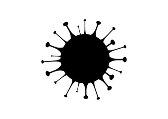{width="100px" style="position: absolute; top: 0%; right: 20%;"}
:::
::: {.fragment .fade-in}
{width="100px" style="position: absolute; top: 60%; left: 30%;"}
:::
::: {.fragment .fade-in}
{width="100px" style="position: absolute; top: 70%; left: 70%;"}
:::

::: notes
"June 2021. The Netherlands. COVID cases were falling, vaccines were rolling out, and things were starting to feel almost normal again."
:::

---

## June 2021 in the Netherlands

::::::: r-stack
::: {.fragment .fade-in-then-out}
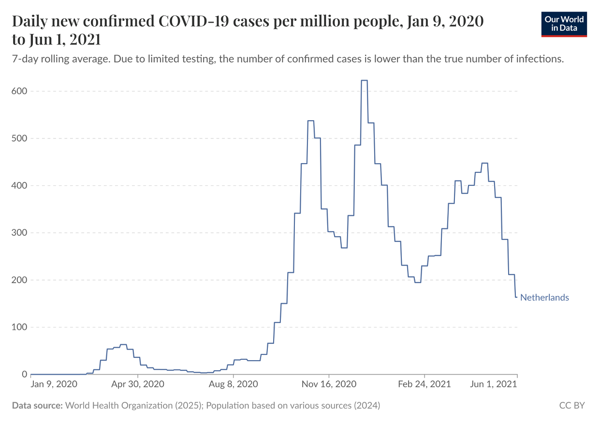{width="100%" style="max-height: 600px; object-fit: contain;"}
:::
::: {.fragment .fade-in-then-out}
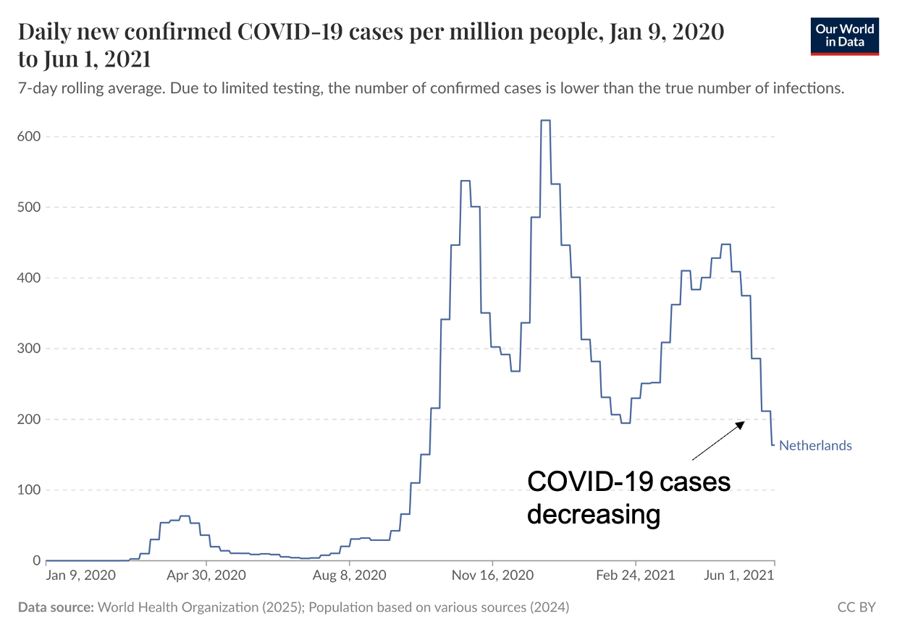{width="98%" style="max-height: 600px; object-fit: contain;"}
:::
::: {.fragment .fade-in-then-out}
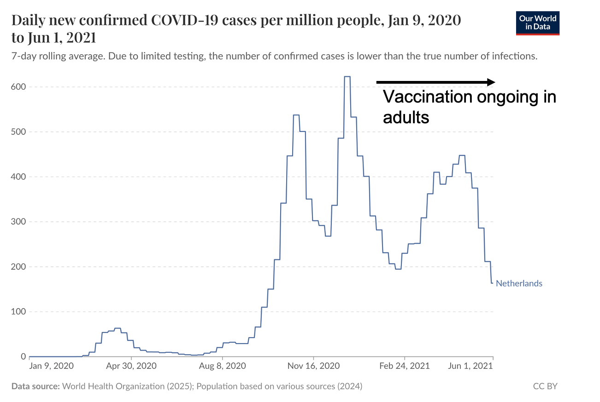{width="100%" style="max-height: 600px; object-fit: contain;"}
:::
::: {.fragment .fade-in}
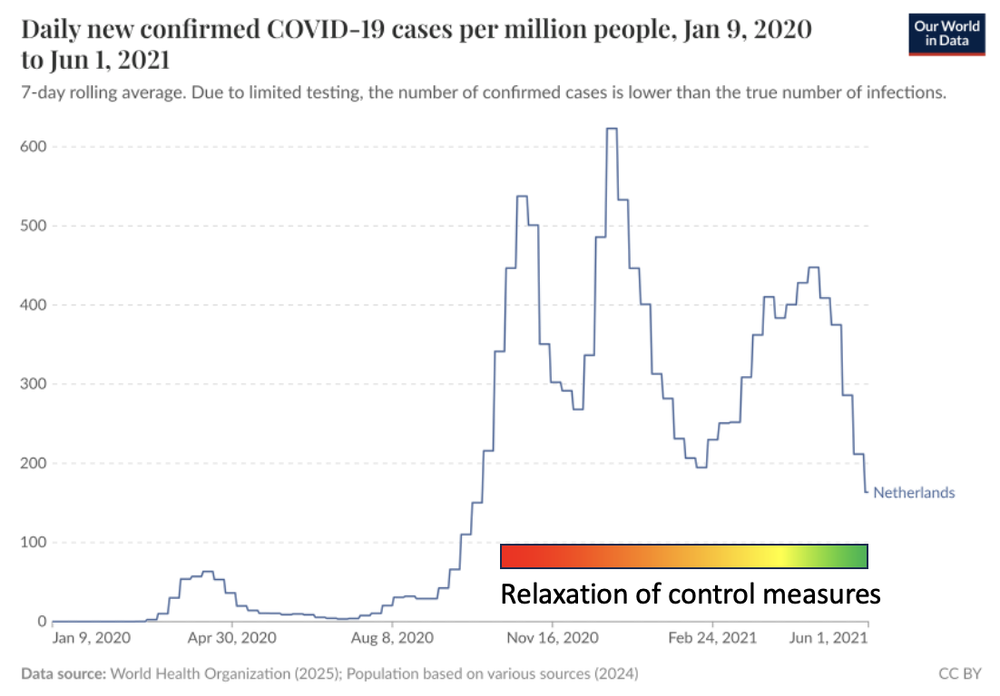{width="98%" style="max-height: 600px; object-fit: contain;"}
:::
:::::::

---

## June 2021 in the Netherlands

::: {.fragment .r-fit-text style="text-align: center;"}
*Should the Netherlands extend COVID-19 vaccination to adolescents and children?*

{width="25%"}
:::

---

## Structure

::::: columns
::: {.column width="50%"}
**:white_check_mark: Package Structure**

```{=html}
<pre style="font-family: monospace; margin: 0; font-size: 24px;">
📦 mypackage/
├── R/            # Code
├── inst/extdata/ # Data + Scripts
├── man/          # Help files
└── vignettes/    # Analysis
</pre>
```
:::
::: {.column width="50%"}
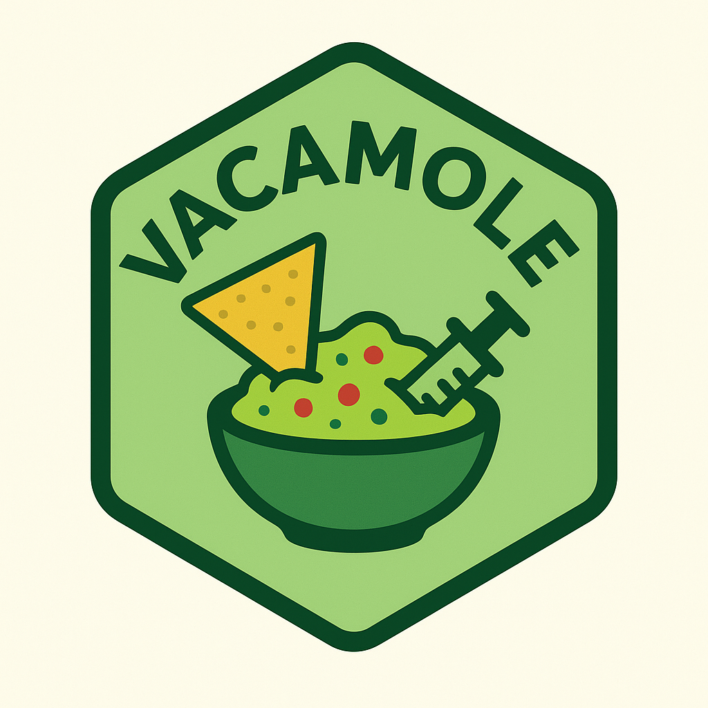
:::
:::::

---

## {background-color="#2E4057"}

:::{style="display: flex; justify-content: center; align-items: center; height: 100%;"}
::: {style="text-align: center; color: white; font-size: 4em;"}
Organise → Efficiency
:::
:::

---

## Organise → Efficiency

:::::::::: columns
:::: {.column width="50%"}

::: incremental
- :arrows_counterclockwise: Model rapidly updated as new data came in
- :alarm_clock: Analysis delivered on time
- :syringe: Directly informed national health policy
:::
::::

:::: {.column width="50%"}
::: r-stack
::: {.fragment index="1"}
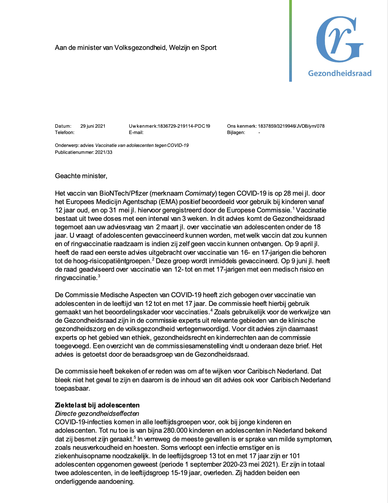{width="90%" style="max-height: 80vh; object-fit: contain; border: 2px solid black;"}
:::
::: {.fragment index="2"}
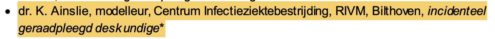{width="90%" style="max-height: 60vh; object-fit: contain; border: 2px solid black;"}
:::
::: {.fragment index="3"}
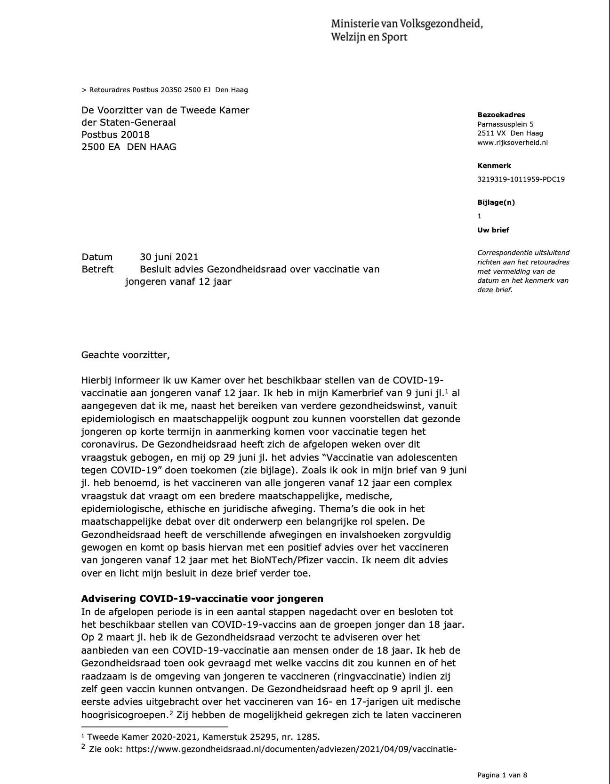{width="90%" style="max-height: 80vh; object-fit: contain; border: 2px solid black;"}
:::
::: {.fragment index="4"}
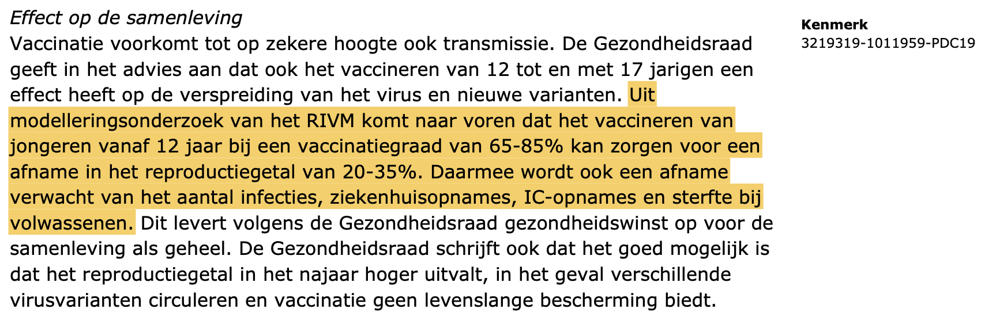{width="90%" style="max-height: 60vh; object-fit: contain; border: 2px solid black;"}
:::
::: {.fragment index="5"}
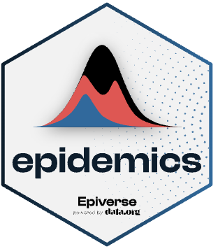{width="90%" style="max-height: 60vh; object-fit: contain;"}
:::
:::
::::
::::::::::

::: notes

:::

---

## {background-color="#2E4057"}

:::{style="display: flex; justify-content: center; align-items: center; height: 100%;"}
::: {style="text-align: center; color: white; font-size: 4em;"}
Share
:::
:::

---

## Scabies in the Netherlands

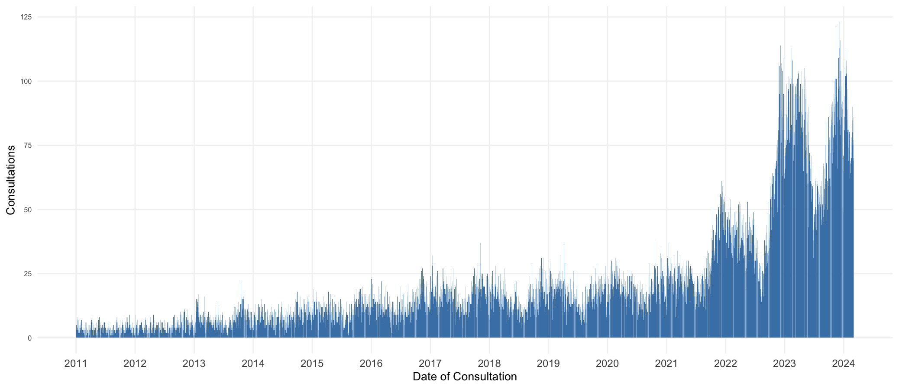{width="95%" style="max-height: 70vh; object-fit: contain;"}

::: notes
"I was asked to look into scabies transmission in the Netherlands. Cases were increasing and we needed to understand how fast it was spreading."
:::

---

## Vink et al.

::::: columns
::: {.column width="60%"}
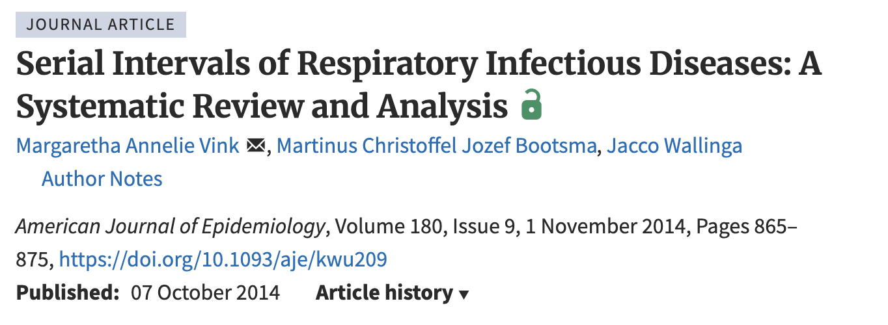{width="100%" style="max-height: 70vh; object-fit: contain;"}
:::
::: {.column width="40%"}
::: {style="display: flex; align-items: center; justify-content: center; height: 70vh;"}
::: r-stack
::: {.fragment index="1" style="font-size: 6em;"}
💻
:::
::: {.fragment index="2" style="font-size: 4em; color: red;"}
❌
:::
:::
:::
:::
:::::

::: notes
- Wanted to use Vink et al. published in 2014. 
- Solid, well-validated, but no implementation.
- I had to code it from scratch myself.
:::

---

## Vink et al.

::::: columns
::: {.column width="50%"}
{width="95%" style="max-height: 70vh; object-fit: contain;"}
:::
::: {.column width="50%"}
::: {style="display: flex; align-items: center; justify-content: center; height: 70vh;"}
::: r-stack
::: {.fragment index="1" style="font-size: 6em;"}
📦
:::
::: {.fragment index="2" style="font-size: 4em; color: red;"}
✅
:::
::: {.fragment index="3" style="font-size: 4em; color: red;"}

:::
:::
:::
:::
:::::

::: notes
"If I'm writing this code anyway, I might as well structure it so my colleagues can use it too. That's all I was thinking at this point."
:::

---

## Document

::::: columns
:::: {.column width="50%"}
::::
:::: {.column width="50%"}
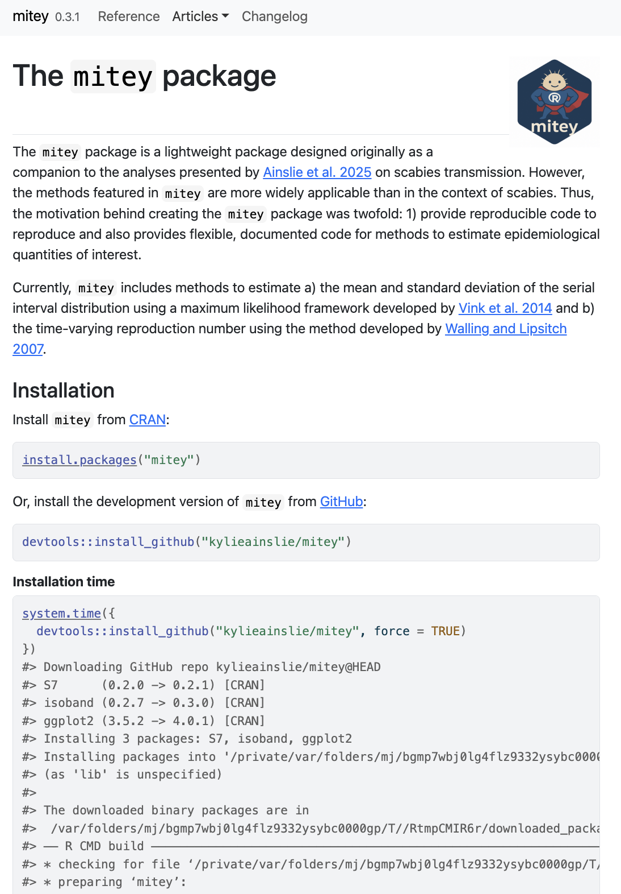{width="95%" style="max-height: 60vh; object-fit: contain;"}
::::
:::::

---

## Document

::::: columns
:::: {.column width="50%"}
- :rocket: Quick start guide
::::
:::: {.column width="50%"}
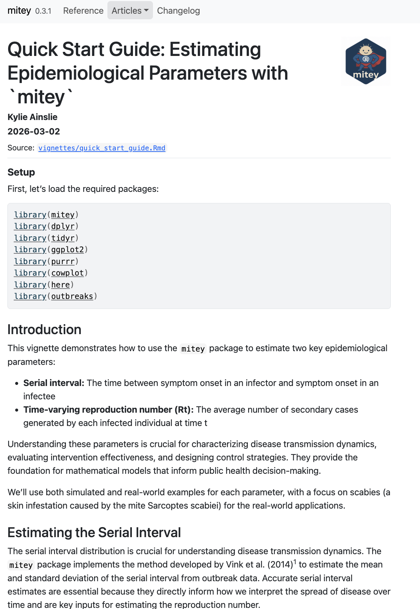{width="95%" style="max-height: 60vh; object-fit: contain;"}
::::
:::::

---

## Document

::::: columns
:::: {.column width="50%"}
- :rocket: Quick start guide
- :bar_chart: Worked examples
::::
:::: {.column width="50%"}
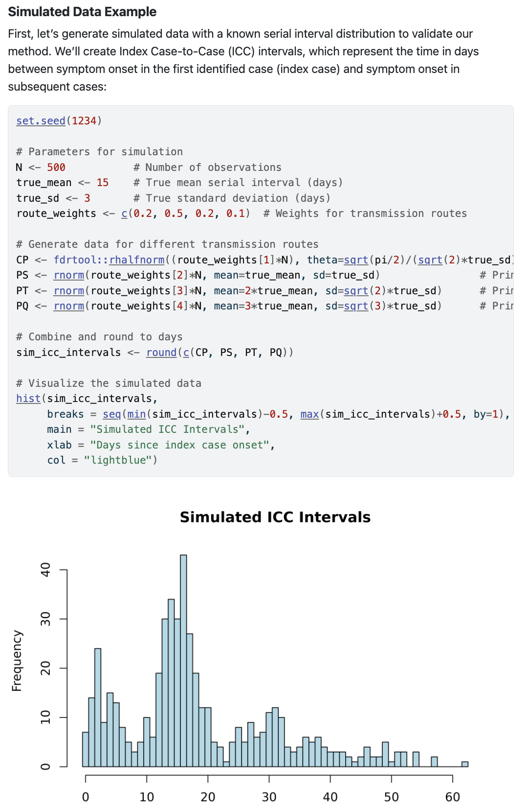{width="95%" style="max-height: 60vh; object-fit: contain;"}
::::
:::::

---

## Document

::::: columns
:::: {.column width="50%"}
- :rocket: Quick start guide
- :bar_chart: Worked examples
- :white_check_mark: Validation
::::
:::: {.column width="50%"}
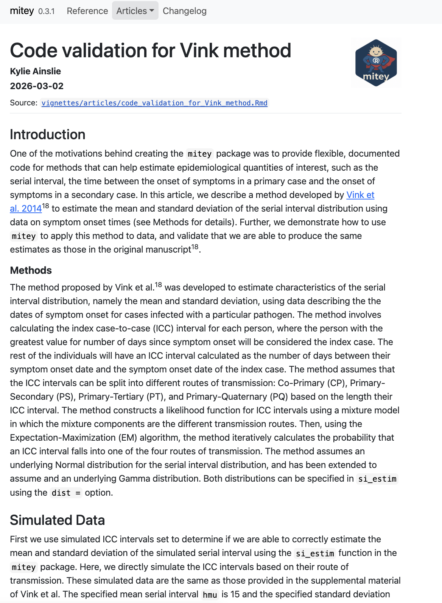{width="95%" style="max-height: 60vh; object-fit: contain;"}
::::
:::::

---

## Document

::::: columns
:::: {.column width="50%"}
- :rocket: Quick start guide
- :bar_chart: Worked examples
- :white_check_mark: Validation
- :page_facing_up: Reproduce paper results
::::
:::: {.column width="50%"}
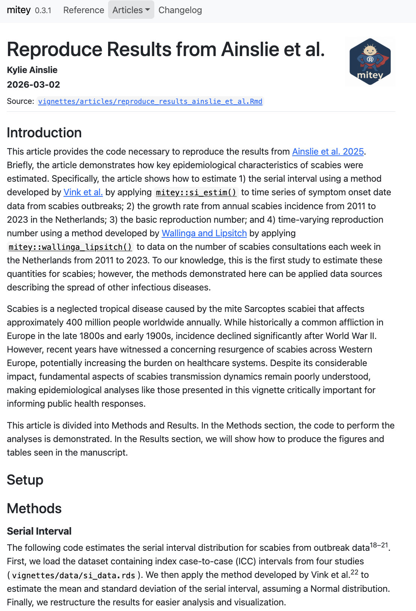{width="95%" style="max-height: 60vh; object-fit: contain;"}
::::
:::::

---

## Document

::::::::::: columns
:::: {.column width="70%"}
::: {.fragment fragment-index="1"}
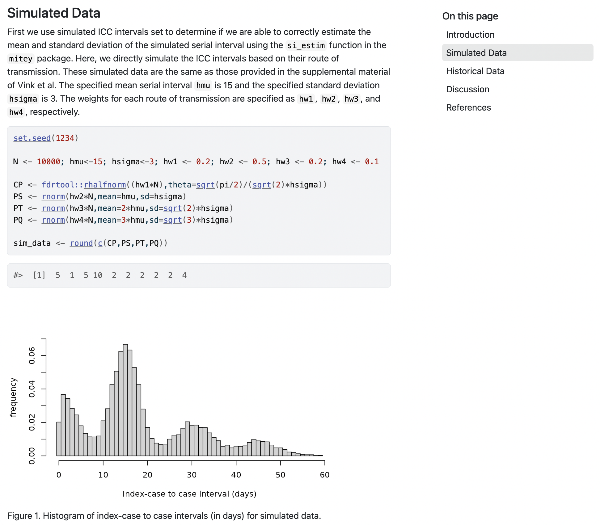
:::
::::

::::: {.column width="10%"}
:::: {.fragment fragment-index="2"}
::: {style="display: flex; align-items: center; justify-content: center; height: 80vh; font-size: 3em; font-weight: bold;"}
<i class="fab fa-plus"></i>
:::
::::
:::::

::::: {.column width="20%"}
:::: {.fragment fragment-index="3"}
::: {style="display: flex; align-items: center; justify-content: center; height: 80vh; font-size: 5em; font-weight: bold;"}
<i class="fab fa-github"></i>
:::
::::
:::::
:::::::::::

---

## Collaboration


::: notes
- Documentation enabled collaboration
- Opened the door to collaboration. 
- Because the package was documented and structured properly, others could see exactly what mitey did and where it might connect with their work.
:::
---

## {background-color="#2E4057"}

:::{style="display: flex; justify-content: center; align-items: center; height: 100%;"}
::: {style="text-align: center; color: white; font-size: 4em;"}
Share → Collaboration
:::
:::

---

## Share → Collaboration

```{=html}
<div style="display: flex; justify-content: center; align-items: center; gap: 40px;">
  
  
</div>
```

::: notes
- We're now exploring those synergies.
- When your work is structured to be shareable, people find it -> directions you didn't expect.
:::

---

## One piece of research. Two outputs
:::: {.columns}

::: {.column width="50%"}
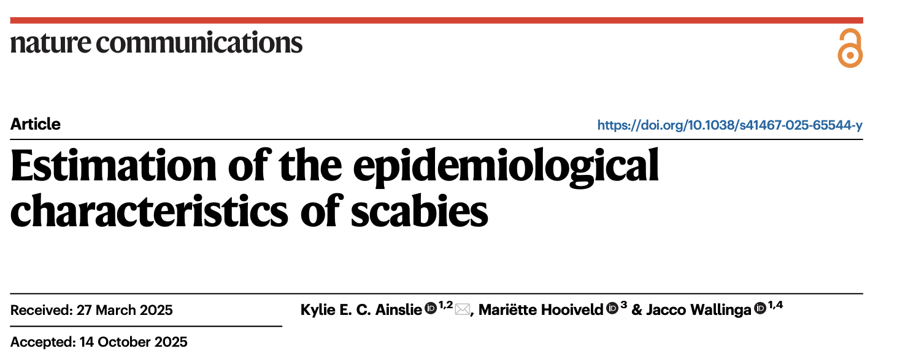{width="100%"}
:::

::: {.column width="50%"}
{width="100%"}
:::

::::

---

{width="75%}

::: notes
Examples 1 & 2 have been about the impacts of this approach on my individual research. But this is not necessarily where it needs to stop, and in fact, it didn't.
:::

---

## {background-color="#2E4057"}

:::{style="display: flex; justify-content: center; align-items: center; height: 100%;"}
::: {style="text-align: center; color: white; font-size: 4em;"}
Extend
:::
:::

::: notes
What started as a file structure helped me develop the confidence to think beyond my own research practices to develop something that would benefit the wider research community. Let me show you!
:::

---

## {background-image="figures/milky_way.jpg" background-size="cover"}

::: {style="position: absolute; bottom: 20px; right: 20px; color: white; font-size: 0.5em;"}
Credit: Shutterstock/Kevin Key
:::

::: notes
As, by now, I've probably convinced you, I'm a fairly confident programmer. But I'm by no means the best. I started to wrestle with the question - how do I find a package that does a function that I want to do, if I don't already know it exists?
:::
---

## Using AI

::::::::: columns

:::: {.column width="20%"}
::: {style="display: flex; align-items: center; justify-content: center; height: 80vh;"}

:::
::::

:::: {.column width="8%"}
::: {style="display: flex; align-items: center; justify-content: center; height: 80vh; font-size: 3em; font-weight: bold;"}
<i class="fas fa-plus"></i>
:::
::::

:::: {.column width="44%"}
::: {style="display: flex; align-items: center; justify-content: center; height: 80vh;"}
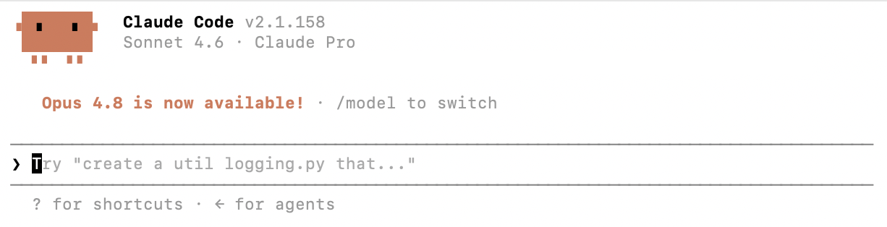
:::
::::

:::: {.column .fragment width="8%"}
::: {style="display: flex; align-items: center; justify-content: center; height: 80vh; font-size: 3em; font-weight: bold;"}
<i class="fas fa-equals"></i>
:::
::::

:::: {.column .fragment width="20%"}
::: {style="display: flex; align-items: center; justify-content: center; height: 80vh;"}

:::
::::

:::::::::

::: notes
This was also around the time I was introduced to Claude Code and was interested in exploring how I could use AI to expand and innovate.
:::
---

## The Warehouse

::: r-stack
:::{.fragment index="1"}
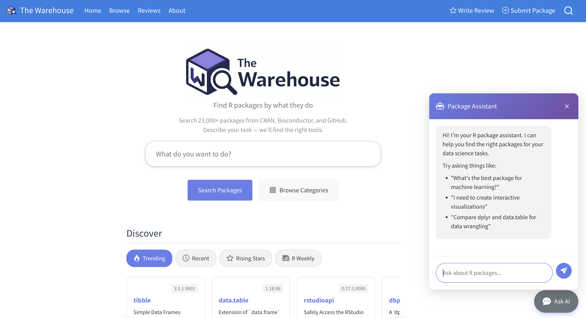
:::

:::{.fragment index="2"}
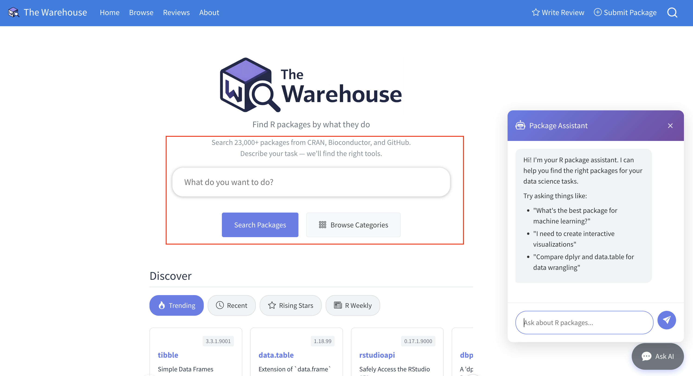
:::

:::{.fragment index="3"}
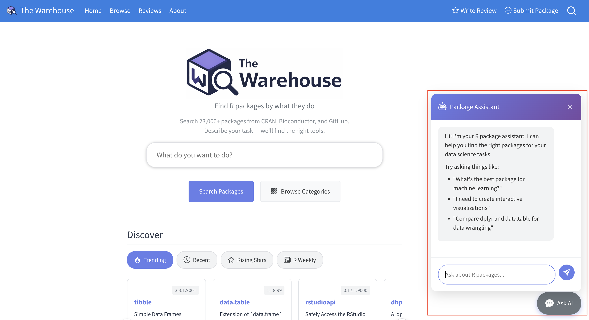
:::

:::{.fragment index="4"}
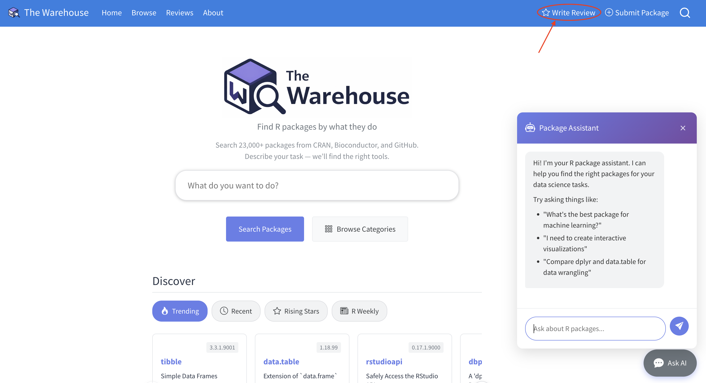
:::
:::

::: notes

:::

---

## {background-color="#2E4057"}

:::{style="display: flex; justify-content: center; align-items: center; height: 100%;"}
::: {style="text-align: center; color: white; font-size: 4em;"}
Extend → Innovate
:::
:::

## Extend → Innovate

::: incremental
- :bulb: Leverage new technology
- :hammer_and_wrench: Develop tools beyond your research area
:::

---

{width="100%"}

::: {.r-fit-text style="text-align: center;"}
*It started with a folder.*
:::

::: notes
"I still don't consider myself a software developer."

Pause.

"But look what became possible."

Pause.

"If I can do this — so can you."
:::

---

## Your turn!

::::::::: columns
:::::: {.column width="55%"}
::: {.fragment fragment-index="1"}
- Try a package structure for your next project
:::
::: {.fragment fragment-index="2"}
- Tons of tools and learning materials available
:::
::: {.fragment fragment-index="4"}
- **You'll never go back to messy folders**
:::
::::::
:::: {.column width="45%"}
::: {.fragment .fade-in fragment-index="3"}

```{=html}
<div style="display: grid; grid-template-columns: 1fr 1fr; gap: 12px; align-items: center; text-align: center; font-size: 0.55em;">

  <div>
    <a href="https://the-turing-way.netlify.app/" target="_blank">
      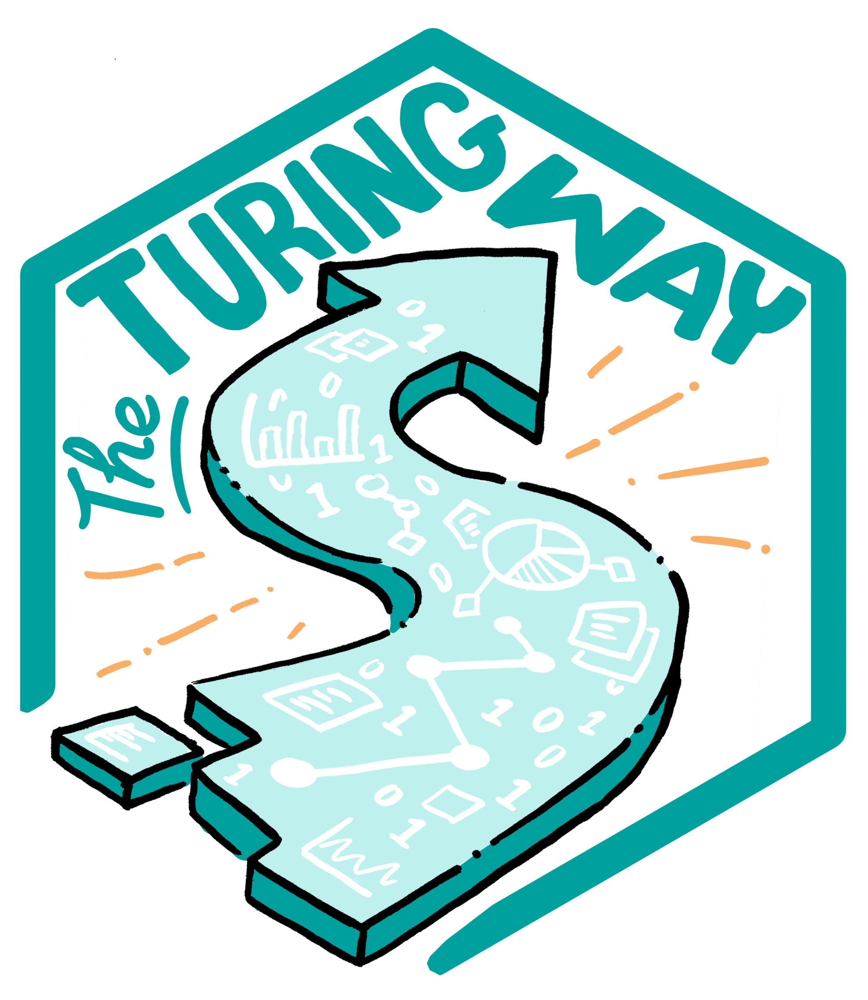
    </a>
    <div>The Turing Way</div>
  </div>

  <div>
    <a href="https://software-carpentry.org/" target="_blank">
      
    </a>
    <div>Software Carpentry</div>
  </div>

  <div>
    <a href="https://www.routledge.com/Research-Software-Engineering-A-Guide-to-the-Open-Source-Ecosystem/Bannert/p/book/9781032261270" target="_blank">
      
    </a>
    <div>Research Software Engineering<br/><em>Bannert</em></div>
  </div>

  <div>
    <a href="https://r-pkgs.org/" target="_blank">
      
    </a>
    <div>R Packages<br/><em>(R users)</em></div>
  </div>

</div>
```

:::
::::
:::::::::

---

## Get in touch!

::::: columns
::: {.column width="60%"}
<i class="fab fa-linkedin"></i> linkedin.com/in/kylieainslie

<i class="fa-brands fa-bluesky"></i> @kylieainslie.bsky.social

<i class="fab fa-github"></i> github.com/kylieainslie

<i class="fas fa-globe"></i> kylieainslie.github.io

<i class="fas fa-warehouse"></i> rwarehouse.netlify.app
:::
::: {.column width="40%"}
{width="100%"}
:::
:::::
