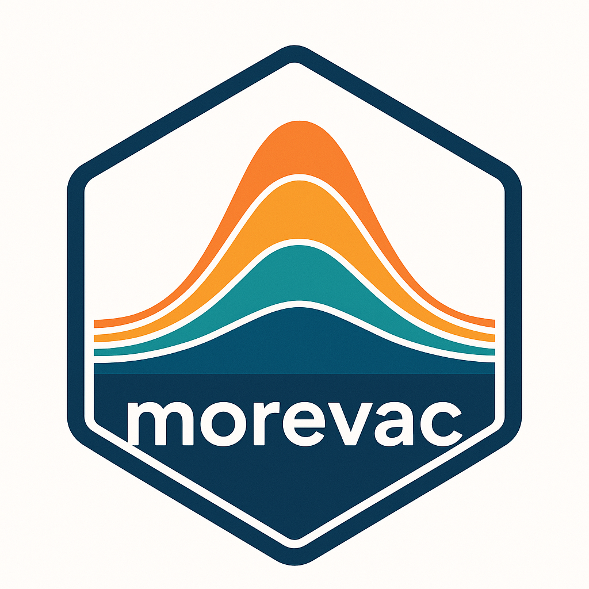
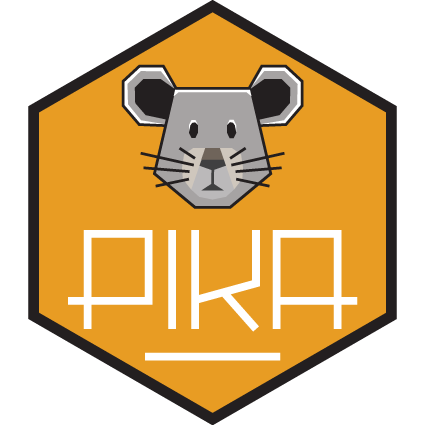

```{=html}
<style>
.pkg-grid {
  display: grid;
  grid-template-columns: repeat(auto-fill, minmax(220px, 1fr));
  gap: 0.5rem;
  margin-bottom: 2rem;
}

details.pkg-item {
  border: 1px solid var(--bs-border-color);
  border-radius: 0.5rem;
  background: var(--bs-body-bg);
  overflow: hidden;
  transition: box-shadow 0.15s;
}

details.pkg-item:hover {
  box-shadow: 0 2px 8px rgba(0,0,0,0.08);
}

details.pkg-item[open] {
  border-color: var(--bs-primary);
}

summary.pkg-summary {
  cursor: pointer;
  list-style: none;
  display: flex;
  flex-direction: column;
  align-items: center;
  padding: 0.75rem 0.75rem 0.5rem;
  gap: 0.4rem;
  user-select: none;
}

summary.pkg-summary::-webkit-details-marker { display: none; }

summary.pkg-summary img {
  height: 90px;
  width: auto;
  object-fit: contain;
}

.pkg-title-row {
  display: flex;
  align-items: center;
  gap: 0.4rem;
  font-weight: 600;
  font-size: 0.95rem;
}

.pkg-expand-hint {
  font-size: 0.65em;
  color: var(--bs-secondary-color);
  transition: transform 0.2s;
}

details[open] .pkg-expand-hint {
  transform: rotate(90deg);
}

.pkg-body {
  padding: 0 0.75rem 0.75rem;
  border-top: 1px solid var(--bs-border-color);
}

.pkg-desc {
  margin-top: 0.5rem;
  font-size: 0.82rem;
  color: var(--bs-secondary-color);
  line-height: 1.4;
}

.pkg-links {
  margin-top: 0.5rem;
  display: flex;
  gap: 0.3rem;
  flex-wrap: wrap;
}
</style>
```

# R Packages

<div class="pkg-grid">

<details class="pkg-item">
<summary class="pkg-summary">

<div class="pkg-title-row">mitey <span class="badge bg-success" style="font-size:0.7em">v0.3.0</span> <span class="pkg-expand-hint">▶</span></div>
</summary>
<div class="pkg-body">
<div class="pkg-desc">A lightweight R package with methods to estimate serial intervals and time-varying reproduction numbers from infectious disease outbreak data.</div>
<div class="pkg-links">
<a href="https://github.com/kylieainslie/mitey" class="btn btn-primary btn-sm">GitHub</a>
<a href="https://cran.r-project.org/package=mitey" class="btn btn-outline-secondary btn-sm">CRAN</a>
<a href="https://doi.org/10.1038/s41467-025-65544-y" class="btn btn-outline-info btn-sm">Publication</a>
</div>
</div>
</details>

<details class="pkg-item">
<summary class="pkg-summary">

<div class="pkg-title-row">vacamole <span class="pkg-expand-hint">▶</span></div>
</summary>
<div class="pkg-body">
<div class="pkg-desc">An R package that features a deterministic age-structured compartmental susceptible-exposed-infectious-recovered (SEIR) model and supporting functions.</div>
<div class="pkg-links">
<a href="https://github.com/kylieainslie/vacamole" class="btn btn-primary btn-sm">GitHub</a>
<a href="https://pmc.ncbi.nlm.nih.gov/articles/PMC9635025/" class="btn btn-outline-info btn-sm">Publication</a>
</div>
</div>
</details>

<details class="pkg-item">
<summary class="pkg-summary">

<div class="pkg-title-row">morevac <span class="pkg-expand-hint">▶</span></div>
</summary>
<div class="pkg-body">
<div class="pkg-desc">An R package that features a multi-annual, individual-based, stochastic, force of infection model that accounts for individual exposure histories and disease/vaccine dynamics influencing susceptibility.</div>
<div class="pkg-links">
<a href="https://github.com/kylieainslie/morevac" class="btn btn-primary btn-sm">GitHub</a>
<a href="https://doi.org/10.1016/j.vaccine.2022.03.065" class="btn btn-outline-info btn-sm">Publication</a>
</div>
</div>
</details>

<details class="pkg-item">
<summary class="pkg-summary">

<div class="pkg-title-row">pika <span class="pkg-expand-hint">▶</span></div>
</summary>
<div class="pkg-body">
<div class="pkg-desc">A lightweight R package for estimating the optimal lag and rolling correlation by grouping variable between two time series.</div>
<div class="pkg-links">
<a href="https://github.com/mrc-ide/pika" class="btn btn-primary btn-sm">GitHub</a>
<a href="https://doi.org/10.12688/wellcomeopenres.15843.2" class="btn btn-outline-info btn-sm">Publication</a>
</div>
</div>
</details>

<details class="pkg-item">
<summary class="pkg-summary">

<div class="pkg-title-row">serosolver <span class="pkg-expand-hint">▶</span></div>
</summary>
<div class="pkg-body">
<div class="pkg-desc">An open source R package for inferring epidemiological and immunological dynamics from serological data using a Bayesian framework to reconstruct individual-level infection histories and estimate antibody kinetics.</div>
<div class="pkg-links">
<a href="https://github.com/seroanalytics/serosolver" class="btn btn-primary btn-sm">GitHub</a>
<a href="https://doi.org/10.1371/journal.pcbi.1007840" class="btn btn-outline-info btn-sm">Publication</a>
</div>
</div>
</details>

</div>

------------------------------------------------------------------------

# Web Applications

<div class="pkg-grid">

<details class="pkg-item">
<summary class="pkg-summary">

<div class="pkg-title-row">The Warehouse <span class="pkg-expand-hint">▶</span></div>
</summary>
<div class="pkg-body">
<div class="pkg-desc">A function-first R package directory that helps data scientists find packages by what they do, not just by their names. Features AI-powered semantic search, curated categories, and community reviews.</div>
<div class="pkg-links">
<a href="https://rwarehouse.netlify.app/" class="btn btn-primary btn-sm">Website</a>
<a href="https://github.com/kylieainslie/warehouse" class="btn btn-outline-secondary btn-sm">GitHub</a>
</div>
</div>
</details>

</div>

------------------------------------------------------------------------

## Collaboration

Interested in contributing to any of these projects? Most repositories welcome contributions via GitHub issues and pull requests. For major collaborations or new project ideas, feel free to reach out via email.
